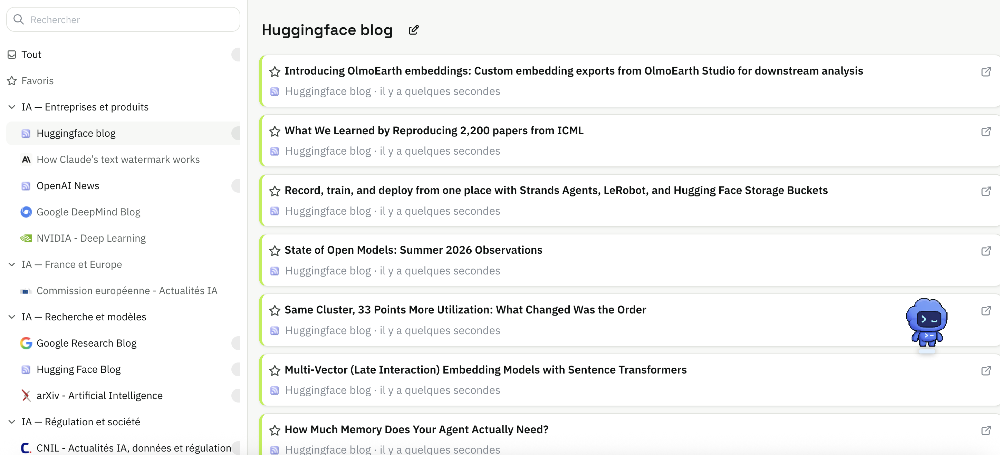
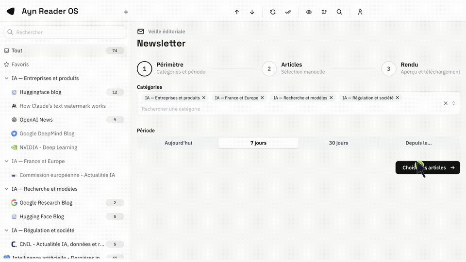

<p align="center">
  
</p>

# AynReader OS

AynReader OS est un outil de veille auto-heberge pour suivre des sources, garder les articles utiles et produire une newsletter a partir de sa selection.

Il reunit la lecture RSS, l'ajout de pages web par scraper, le decodage des liens Google News et la creation de newsletters dans une meme interface.

## Points forts de cette version

- **Creer un flux RSS pour une page sans RSS.** Le scraper integre transforme une page d'actualites en source suivie. Selectionne une carte dans la page et AynReader repere les cartes similaires, puis propose les selectors a corriger si besoin.
- **Deux modes de configuration.** Utilise la detection automatique pour aller vite, ou renseigne directement les selectors CSS du titre, de la description, de l'URL, de l'image et de la date pour garder la main sur l'extraction.
- **Liens Google News exploitables.** AynReader retrouve l'URL de l'editeur, ouvre l'article original et affiche son domaine ainsi que son favicon lorsqu'il est disponible.
- **Newsletter editoriale telechargeable.** Choisis les categories et la periode, selectionne les articles sur plusieurs pages, personnalise le titre et le design, puis telecharge un vrai fichier HTML.

## Fonctionnalites essentielles

- Lecture des flux RSS et Atom, avec organisation par categories et import/export OPML.
- Lecture confortable sur ordinateur et mobile, en mode clair ou sombre.
- Suivi des articles lus, favoris, recherche et plusieurs modes de lecture.

## Lire et organiser sa veille

Les sources restent regroupees par categorie. La colonne de gauche sert a passer d'un sujet ou d'une source a l'autre, tandis que la liste centrale garde les articles lisibles et faciles a parcourir.



## Creer un flux RSS depuis une page sans RSS

Le scraper transforme une page d'actualites qui ne propose pas de flux RSS en une source suivie dans AynReader.

1. Ajoute l'URL de la page et charge-la dans l'outil.
2. Clique sur une carte d'actualite dans l'apercu.
3. AynReader cherche les elements semblables et propose les selectors.
4. Verifie ou modifie les selectors, puis cree la source.

La demonstration ci-dessous montre le parcours complet : charger la page, selectionner une carte et obtenir les selectors proposes.


Le mode `Selectors manuels` reste disponible lorsque tu connais deja la structure de la page ou que la detection automatique ne donne pas le bon resultat. Renseigne les selectors de la carte et de ses champs, puis lance le test avant de creer la source.


## Composer une newsletter

La newsletter suit un parcours editorial : choisir les categories et la periode, selectionner les articles, puis ajuster le titre et le design avant de telecharger le fichier HTML. Le rendu est construit uniquement avec les articles choisis.



## Demarrage en developpement

### Prerequis

- Java 25 ou une version compatible avec le `pom.xml`.
- Node.js 24 et npm.
- Un navigateur recent.

### Installation

```bash
git clone <repository-url>
cd aynreader
cd aynreader-client
npm ci
cd ..
```

### Lancer AynReader OS

Ouvre deux terminaux.

Dans le premier, lance le backend :

```bash
./mvnw -pl aynreader-server quarkus:dev -DskipTests
```

Dans le second, lance le frontend et le scraper :

```bash
cd aynreader-client
npm run dev:all
```

Ouvre ensuite [http://localhost:8082](http://localhost:8082). Lors de la premiere ouverture, l'assistant cree le compte administrateur.

En developpement, le backend ecoute sur `http://localhost:8083` et le scraper sur `http://localhost:3000`.

## Ajouter une source

### Flux RSS ou Atom

1. Ouvre l'ajout de source.
2. Colle l'URL du flux.
3. Choisis la categorie puis valide.

### Creer un flux RSS avec le scraper

1. Ouvre l'ajout de source puis l'onglet `Scrap`.
2. Choisis `Detection automatique` pour selectionner une carte d'actualite dans l'apercu, ou `Selectors manuels` pour renseigner directement la regle.
3. Controle les selectors du titre, de la description, de l'URL, de l'image et de la date. La description et l'image sont facultatives.
4. Lance le test des selectors modifies, puis cree la source.

Un selector de carte doit decrire une seule carte representative. AynReader remonte ensuite dans sa hierarchie pour trouver le niveau qui se repete et en deduit la liste des actualites.

## Liens Google News

Lorsqu'une entree contient un lien `news.google.com`, AynReader essaie de retrouver l'URL de l'article original pendant l'actualisation. La lecture ouvre alors directement le site editeur et affiche son domaine et son favicon lorsque celui-ci est disponible.

## Developpement et tests

Commandes frontend :

```bash
cd aynreader-client
npm run lint
npm run test:ci
npm run build
```

Commandes backend :

```bash
./mvnw -pl aynreader-server test
./mvnw -pl aynreader-server verify
```

## Configuration du scraper

Le scraper local accepte les variables suivantes :

- `SCRAPER_PORT` : port du service, `3000` par defaut.
- `SCRAPER_TIMEOUT_MS` : delai maximum de chargement d'une page.
- `SCRAPER_PROXY_URL` : proxy reseau facultatif.
- `VITE_SCRAPER_API_BASE` : adresse du service utilisee par le frontend.

## Securite

Pour signaler une vulnerabilite qui ne doit pas etre exposee dans une issue publique, utilise une private security advisory depuis l'onglet Security du depot.

## Licence

AynReader OS est distribue sous licence Apache 2.0. Consulte le fichier [LICENSE](LICENSE) avant toute redistribution.
