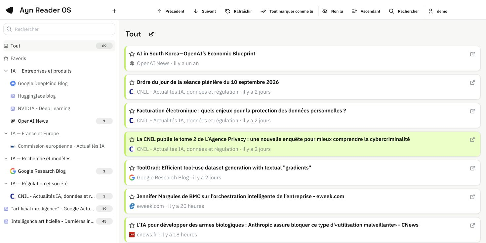
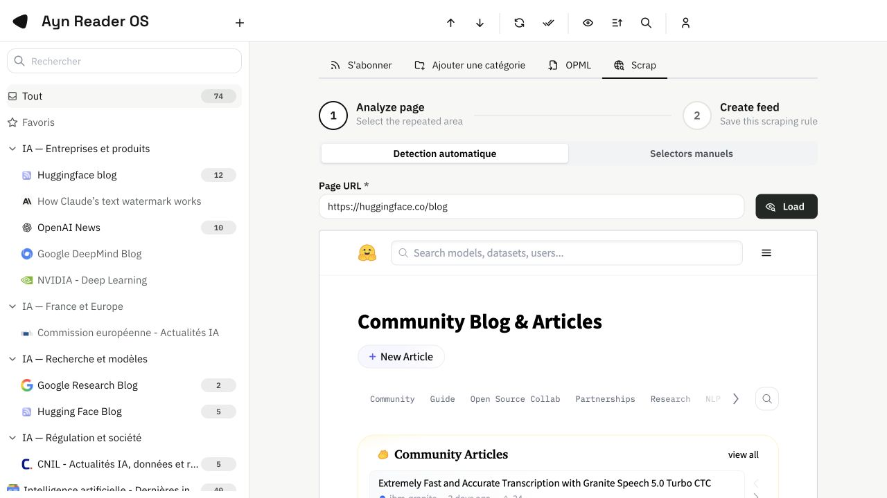
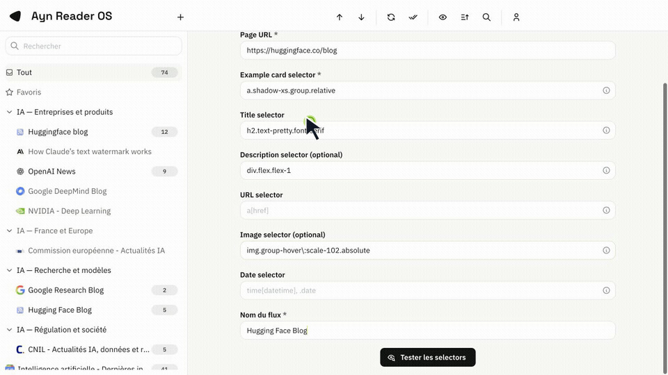

<p align="center">
  
</p>

<p align="center">
  Un outil de veille auto-heberge pour suivre l'information, organiser ses sources et produire une newsletter.
</p>

<p align="center">
  <a href="https://github.com/Glyphosate69/aynreader/actions/workflows/ci.yml">Verification continue</a>
  &nbsp;&middot;&nbsp;
  <a href="#demarrage-rapide">Demarrage rapide</a>
  &nbsp;&middot;&nbsp;
  <a href="#creer-une-source-depuis-une-page-sans-rss">Scraper</a>
  &nbsp;&middot;&nbsp;
  <a href="#creer-une-newsletter">Newsletter</a>
</p>



## Pourquoi AynReader OS ?

AynReader OS reunit dans une seule interface les gestes essentiels de la veille : suivre des flux RSS, classer les sources par categorie, lire et garder les articles utiles, creer des sources depuis des pages sans flux RSS, puis produire une newsletter HTML a telecharger.

Il est pense pour les veilleurs, les analystes, les communicants et toute personne qui veut garder une vue claire sur plusieurs sujets sans dependre d'un service tiers.

### Ce que vous pouvez faire

| Fonction | Ce que cela apporte |
| --- | --- |
| Lire des flux RSS et Atom | Centraliser les actualites de vos sites, blogs et medias. |
| Organiser par categories | Separer vos sujets de veille et retrouver rapidement une source. |
| Creer un flux depuis une page web | Suivre une page d'actualites qui ne propose pas de RSS. |
| Decoder les liens Google News | Ouvrir l'article chez son editeur et afficher son domaine. |
| Recuperer les favicons | Identifier plus facilement le media a l'origine d'un article. |
| Composer une newsletter | Choisir les articles, adapter le titre et le design, puis telecharger un fichier HTML. |

## Demarrage rapide

### 1. Installer les prerequis

Pour lancer AynReader depuis le code source, installez :

- Java 25.
- Node.js 24 et npm.
- Git.

### 2. Recuperer le projet

```bash
git clone https://github.com/Glyphosate69/aynreader.git
cd aynreader
```

### 3. Lancer AynReader

Ouvrez deux terminaux dans le dossier du projet.

Dans le premier, lancez le serveur AynReader :

```bash
./mvnw -pl aynreader-server quarkus:dev -DskipTests
```

Dans le second, lancez l'interface et le scraper :

```bash
cd aynreader-client
npm ci
npm run dev:all
```

Ouvrez ensuite [http://localhost:8082](http://localhost:8082). Lors de la premiere ouverture, l'assistant vous invite a creer le compte administrateur.

> En developpement, le serveur AynReader utilise le port `8083`, l'interface le port `8082` et le scraper local le port `3000`.

## Votre premiere veille

1. Creez une categorie, par exemple `Intelligence artificielle`, `Concurrents` ou `Reglementation`.
2. Cliquez sur le bouton `+` dans la barre superieure.
3. Collez l'URL d'un flux RSS ou Atom.
4. Choisissez la categorie, puis ajoutez la source.
5. Ouvrez la source dans la colonne de gauche pour lire les articles recuperes.

Vous pouvez creer autant de categories et de sources que necessaire. Les favoris permettent de conserver les articles a relire ou a reutiliser.

## Creer une source depuis une page sans RSS

Certaines pages d'actualites ne publient pas de flux RSS. AynReader peut les suivre grace a son scraper integre : il lit la page et cree une source a partir des cartes d'actualites qui s'y repetent.

### Detection automatique

1. Ouvrez l'ajout de source, puis l'onglet `Scrap`.
2. Choisissez `Detection automatique`.
3. Collez l'URL de la page d'actualites et cliquez sur `Load`.
4. Cliquez sur une seule carte d'actualite representative dans l'apercu.
5. Cliquez sur `Detect elements`.
6. Verifiez les selectors proposes pour le titre, la description, l'image, l'URL et la date.
7. Testez les selectors modifies, puis creez la source.

Le scraper part d'une carte unique et recherche son niveau repetitif dans la page pour trouver les autres actualites.



### Selectors manuels

Lorsque vous connaissez deja la structure d'une page, choisissez `Selectors manuels`. Renseignez le selector de la carte et, si necessaire, ceux de ses champs : titre, description, image, URL et date.

La description et l'image sont facultatives. Utilisez le bouton de test avant de creer la source afin de controler les articles qui seront recuperes.



### Si une page ne se charge pas

Certains sites bloquent les navigateurs automatises, demandent une connexion ou rendent leurs actualites uniquement avec JavaScript. Dans ce cas, AynReader ne peut pas toujours lire la page. Cherchez d'abord un flux RSS officiel ; sinon, essayez une page publique plus directe ou le mode manuel si le contenu est visible dans l'apercu.

## Liens Google News et favicon du media

Les flux Google News redirigent souvent vers une URL technique. Lors de l'actualisation, AynReader essaie de retrouver le lien de l'editeur. La liste d'articles affiche alors le domaine du media et son favicon quand il est disponible.

Vous ouvrez ainsi l'article original, plutot que la redirection Google News.

## Creer une newsletter

La newsletter est un parcours en trois etapes : definir le perimetre, choisir les articles, puis telecharger le rendu.

1. Ouvrez `Newsletter` dans le menu.
2. Selectionnez les categories et la periode : dernieres 24 h, 7 jours, 30 jours ou une date de depart.
3. Recherchez et cochez les articles a inclure. La selection reste conservee lorsque vous changez de page.
4. Choisissez `Continuer`.
5. Modifiez le titre si besoin, choisissez l'un des quatre designs et activez ou non les images principales.
6. Cliquez sur `Telecharger la newsletter (.html)`.

Le fichier telecharge est une vraie newsletter HTML composee uniquement avec les articles que vous avez selectionnes.


## Conseils d'utilisation

- Utilisez une categorie par sujet de veille : elle sert aussi a definir le perimetre de la newsletter.
- Pour un scraper, selectionnez une vraie carte d'actualite, pas le conteneur general de toute la page.
- Lorsque la detection est presque bonne, corrigez simplement le champ en erreur dans le formulaire puis testez a nouveau les selectors.
- Une source RSS peut fournir des articles anciens lors de son premier ajout : filtrez la newsletter par periode de publication pour ne garder que les elements utiles.

## Developpement et tests

Commandes pour verifier le projet avant une contribution :

```bash
./mvnw --batch-mode --no-transfer-progress verify -Ph2
```

Commandes frontend utiles :

```bash
cd aynreader-client
npm run lint
npm run test:ci
npm run build
```

### Configuration du scraper local

| Variable | Role |
| --- | --- |
| `SCRAPER_PORT` | Port du service scraper. La valeur par defaut est `3000`. |
| `SCRAPER_TIMEOUT_MS` | Delai maximum de chargement d'une page. |
| `SCRAPER_PROXY_URL` | Proxy reseau facultatif. |
| `VITE_SCRAPER_API_BASE` | Adresse du scraper utilisee par l'interface. |

## Securite

Pour signaler une vulnerabilite sans ouvrir une issue publique, utilisez une private security advisory depuis l'onglet `Security` du depot.

## Licence

AynReader OS est distribue sous licence [Apache 2.0](LICENSE).
